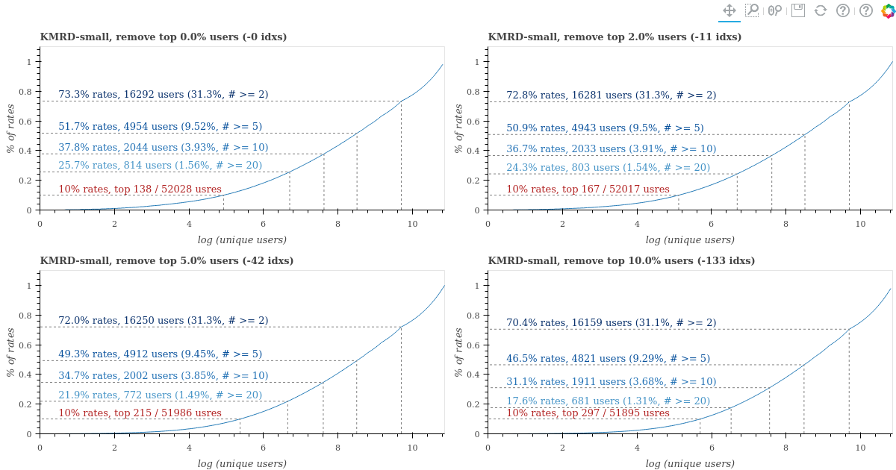
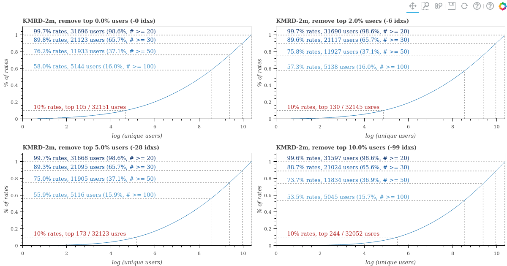
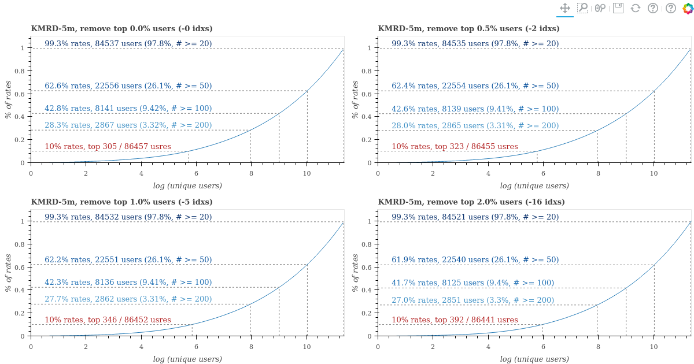
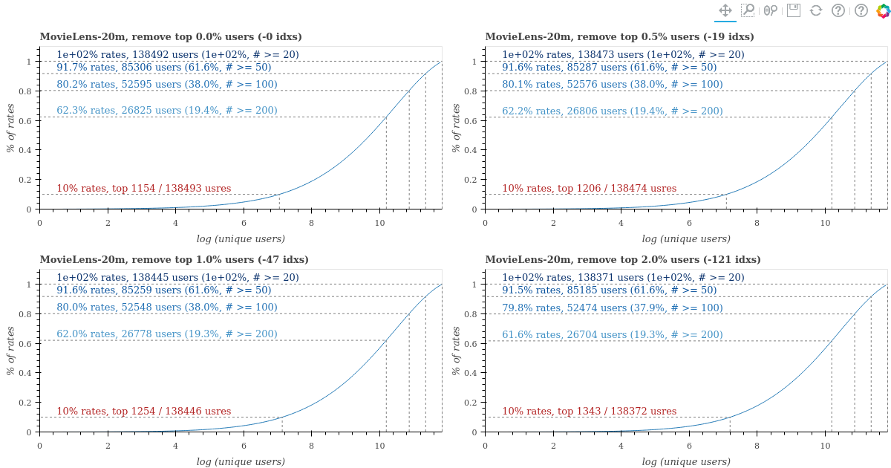

# Korean Movie Recommender system Dataset

MovieLens style synthetic dataset built from Naver Movie rating systems with [Naver Movie Scraper][scraper]

[scraper]: https://github.com/lovit/naver_movie_scraper

## Install

Clone this repository, and execute python script

```
git clone https://github.com/lovit/kmrd
python setup.py install
```

## Load data

`load_rates` function returns sparse matrix formed user-item-rate matrix and numpy.ndarray formed timestamp. All identifier of users are masked. `timestamps` format is UNIX time (second). Choose the size from ['small', '2m', '5m']

```python
from kmr_dataset import load_rates
from kmr_dataset import get_paths

paths = get_paths(size='small')
# paths = get_paths(size='2m')
rates, timestamps = load_rates(size='small')
# rates, timestamps = load_rates(size='5m')
```

`load_histories` function returns dict of list formed user histories

```python
from kmr_dataset import load_histories

histories = load_histories(size='small')
```

To see the histories of user 0,

```python
historeis[0]
```

The result follows the format of (item, rate, UNIX time).

```
[(10003, 7, 1494128040),
 (10004, 7, 1467529800),
 (10018, 9, 1513344120),
 (10021, 9, 1424497980),
 (10022, 7, 1427627340),
 (10023, 7, 1428738480),
 (10024, 4, 1429359420),
 ...
```

## Statistics

### KMRD-small

Some users in KMRD-small have rated only one item. The first comment, `73.3% rates, 16292 users (31.3%, # >= 2)`, means that 73.3% (user, item) elements consists of 16292 users who did rating at least 2 items. There are also heavy users who have rated many movies. Therefore, after removing them, we listed the results of performing the same statistics.

```
Description
 - num user : 52028
 - num item : 10999
 - num unique user : 52028 (100.0 %)
 - num unique item : 600 (5.455 %)
 - num of nonzero : 134331
 - sparsity : 0.9997652606410895
 - sparsity (compatified) : 0.9956968363189052
```



### KMRD-2m

All users in KMRD-2m and KMRD-5m have rated at least 20 times. However, some users have done to same items duplicatedly in KMRD dataset. 

```
Description
 - num user : 32151
 - num item : 191238
 - num unique user : 32151 (100.0 %)
 - num unique item : 41706 (21.81 %)
 - num of nonzero : 2569799
 - sparsity : 0.9995820440836619
 - sparsity (compatified) : 0.9980835118800974
```



### KMRD-5m

```
Description
 - num user : 86457
 - num item : 191238
 - num unique user : 86457 (100.0 %)
 - num unique item : 48840 (25.54 %)
 - num of nonzero : 4941301
 - sparsity : 0.9997011405760968
 - sparsity (compatified) : 0.9988297854523261
```



### MovieLens-20m

In contrast to, MovieLens dataset does not include the duplicated (user, item) elements.

```
Description
 - num user : 138494
 - num item : 131263
 - num unique user : 138493 (100.0 %)
 - num unique item : 26744 (20.37 %)
 - num of nonzero : 20000263
 - sparsity : 0.9988998233532408
 - sparsity (compatified) : 0.9946001521864456
```



## Files of dataset

Dataset consists of following files.

### Movie Information File, `movies.txt`

Tap separated metadata table, (movie idx, Korean title, English title, first open year, grade)

```
movie	title	title_eng	year	grade
10107	아웃 오브 아프리카	Out Of Africa , 1985	1986	PG
13252	시계태엽 오렌지	A Clockwork Orange , 1971		청소년 관람불가
24452	매트릭스	The Matrix , 1999	2016	12세 관람가
39516	달콤한 인생	A Bittersweet Life , 2005	2005	청소년 관람불가
...
```

```python
import pandas as pd
from kmr_dataset import get_paths

path = get_paths(size='small')[3]
df = pd.read_csv(path)
df.head()
```

|  | movie | title | title_eng | year | grade |
| --- | --- | --- | --- | --- | --- |
| 0 | 10001 | 시네마 천국 | Cinema Paradiso , 1988 | 2013.0 | 전체 관람가 |
| 1 | 10002 | 빽 투 더 퓨쳐 | Back To The Future , 1985 | 2015.0 | 12세 관람가 |
| 2 | 10003 | 빽 투 더 퓨쳐 2 | Back To The Future Part 2 , 1989 | 2015.0 | 12세 관람가 |
| 3 | 10004 | 빽 투 더 퓨쳐 3 | Back To The Future Part III , 1990 | 1990.0 | 전체 관람가 |
| 4 | 10005 | 스타워즈 에피소드 4 - 새로운 희망 | Star Wars , 1977 | 1997.0 | PG |

### People Information File, `peoples.txt`

Tap separated people name table, (people id, Korean name, English name)

```
people	korean	original
73	릴리 워쇼스키	Lilly Wachowski
214	캐리 앤 모스	Carrie-Anne Moss
554	헬레나 본햄 카터	Helena Bonham Carter
581	류승완	RYOO Seung-wan
688	제프 다니엘스	Jeff Daniels
1824	송강호	Song Kang-ho
1897	이범수	
1898	이병헌	Byung-hun Lee
1969	전도연	
2009	천호진	
...
```


### Casting Information File, `castings.csv`

Comma separated table, (movie id, people id, credit order, leading role)

- `reading` 1 means the people acts as leading role
```
movie,people,order,leading 
10107,1336,1,1
10107,1061,2,1
10107,892,3,0
10107,4879,4,0
10107,11143,5,0
10107,7020,6,0
...
```

### Rating matrix , `ratings.csv`

Comma separated table, (user index, movie id, rate, time)

- `rate` is 1 - 10 integer score
- `time` is UNIX time format

```
user,movie,rate,time
0,10107,10,1452358200
1,10107,5,1406125440
2,10107,8,1255014420
3,10107,7,1169798460
```

### Countries, `countries.csv`

Comma separated table, (movie id, country)

```
movie,country
10001,이탈리아
10001,프랑스
10002,미국
10003,미국
10004,미국
10005,미국
...
```

### Genres, `genres.csv`

Comma separated table, (movie id, genre)

```
movie,genre
10001,드라마
10001,멜로/로맨스
10002,SF
10002,코미디
10003,SF
10003,코미디
...
```
